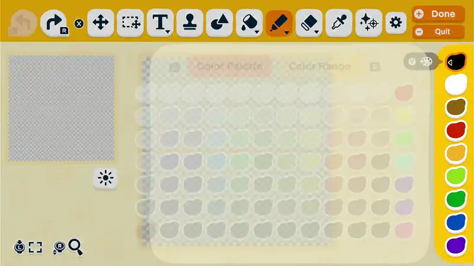
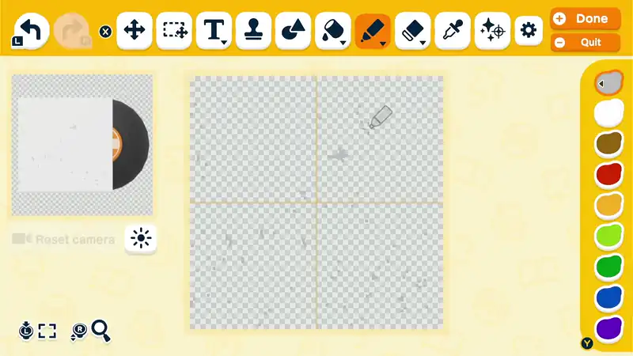

# TomodachiDrawer V2

> **This is TomodachiDrawer V2** — a modified version of the original
> [TomodachiDrawer](https://github.com/Lucas7yoshi/TomodachiDrawer) by
> Lucas7yoshi. It adds **ESP32-S3 support** (in parallel with the existing
> RP2040 target) and **fixes** to the original code (notably a HID report
> descriptor size mismatch). Original work © Lucas7yoshi; V2 changes
> (ESP32-S3 port and fixes) © 2026 Xoan (github.com/xoaninc). Both are
> licensed under **GPL-3.0** (see [LICENSE](./LICENSE)). Per the GPL, the
> original author's copyright is preserved and these modifications are
> distributed openly under the same license.
>
> ESP32-S3 firmware lives in
> [`TomodachiDrawer.Firmware.ESP32/`](./TomodachiDrawer.Firmware.ESP32/) — see
> its README for build/flash instructions.

TomodachiDrawer is a collection of firmware and software that generates inputs to control a Nintendo Switch to draw arbitrary images in the Palette House.

## WARNING: Switch 1 is prone to desyncs
See #12 , unfortunately it seems that the Switch 1 is prone to desyncing randomly from inexplicable lag spikes. Current testing suggests this is related to the 3D preview. Switch 2 users are unaffected, and drawings of types that are just lone transparent images do not seem to be prone to these effects. 0.3.1 and 0.3.2 added some mitigations for some other types of delay, but the lag one is still under investigation. If you have any information or clips of the desync occuring, be sure to comment it on that issue!

The program splits images into layers matched to colours in the game, and generates optimized routes for the pen to follow to draw your image.

It has a crossplatform Avalonia UI desktop app that supports flashing directly to a RP2040-Zero which can then be plugged into the USB port of a Switch or Switch 2 where it will begin to draw.

## Hardware Compatibility
This was designed for an RP2040-Zero as it was one of the cheapest options, however any RP2040 based board *should* be compatible, with support for the LED on the standard Raspberry Pi Pico too.

**V2 also supports the ESP32-S3** (tested on the ESP32-S3-DevKitC-1) in parallel with the RP2040 — see below.

## ESP32-S3 Support (V2)

V2 adds an ESP32-S3 target so you can use a board you may already own instead of an RP2040. It draws on the Switch exactly the same way (it emulates the same HORI Pokken Pad over USB), and the per-drawing data limit is identical (1 MB).

**Validated drawing on a real Switch 2.**

### Which board?
- ✅ **ESP32-S3** with native USB (e.g. **ESP32-S3-DevKitC-1**). The LED is the onboard NeoPixel (GPIO 48 on the DevKitC-1).
- ❌ A classic **ESP32 + CP2102** will *not* work — that chip has no native USB device support (the CP2102 is only a serial bridge).

### The DevKitC-1 has two USB-C ports
- **UART** port (USB-serial bridge): fine for flashing.
- **USB** port (the S3's native USB): use this for flashing *and* for the Switch. You can do the whole flow on this one port.

To put the board in **download mode** (needed for any flashing): **hold BOOT, tap RESET, release BOOT.**

### Using the desktop app (no command line needed)
1. Open the desktop app. The bottom of the left column has an **"ESP32-S3 Output"** section (there's a **"Setup Steps (ESP32)"** button with this guide built in).
2. **First time only:** put the board in download mode, pick its COM port, press **"Flash Base Firmware (ESP32)"**. When it says Done, tap **RESET** to run it. *(If the LED gets stuck on solid yellow, tap RESET again — the software reset doesn't always start the app.)*
3. **For each image:** load your image (≤ 256×256), choose **Switch 2** as the version, put the board in download mode again, and press **"Export To ESP32!"**. A real drawing can take a while to flash — that's expected.
4. Unplug from the PC and plug the **USB** port into your Switch.
5. On the Switch: enable **Settings → Controllers and Sensors → Wired Pro Controller Communication**, open Palette House on the advanced UI, cursor at the top-left, zoomed out, top colour black.

**LED meanings:** dim white = idle, blinking yellow = startup countdown, green = drawing (button held), red blink = no/invalid image data, rainbow = finished.

### Building the firmware from source
See [`TomodachiDrawer.Firmware.ESP32/README.md`](./TomodachiDrawer.Firmware.ESP32/) for ESP-IDF build/flash/test instructions and the technical notes (including the HID descriptor fix).

## How To Use

Initial setup requires a few steps, made easier by the UI.

### Following the YouTube tutorial is recommended:

Note: flashing lights warning for video, apologies.
[YouTube Tutorial](https://youtu.be/GIaiw3gzabo)

An addendum video covering the changes since that was made is available here:
[Addendum Tutorial](https://youtu.be/9rVLea1-nlY)

### Downloads
Downloads are available in the releases, they come in a few forms

[Releases](https://github.com/Lucas7yoshi/TomodachiDrawer/releases)

- TomodachiDrawer.UI.Avalonia.#.#.#.platform.zip
platform can be win64 for windows, osx-arm64 for Mac on ARM cpus, osx64 for Mac on x64 cpus, and linux64 and linuxarm64 for the same on linux.
Download the one that is right for your computer, for mac users with any recent macbook arm64 should work.

For Linux and Mac users, you may need to run chmod +x binaryNameHere or go into your settings to allow it.

### Or briefly, in text:

1. Download the Desktop app here, for your platform: https://github.com/Lucas7yoshi/TomodachiDrawer/releases
3. Extract the zip folder
4. Run TomodachiDrawer.UI.Avalonia.[YourPlatform].exe (or similar for your platform)
5. Plug in your RP2040-Zero (or Raspberry Pi Pico) to your PC while holding the boot button, or while connected hold BOOT and press reset while still holding boot.
6. The program should recognize it.
7. Press "Flash Base Firmware", this will install the code that handles sending the inputs.
8. Repeat the steps to hold the boot button, then open your image by pressing the open button or dragging it in. It must be 256x256 or smaller.
9. Select the Colour Matcher that looks best (arbitrary uses the full range), adjust the TSP solver time limit (explained in the ? button) as needed.
10. Select "Export to RP2040" which will write it directly to the RP2040.
11. Unplug the RP2040 and connect it to your switch (Note: Ensure "Wired Pro Controller Communication" is enabled in your settings!)
    - Note: you must have Palette house open, on "pro" mode, the cursor in the top left of where you want it drawn, zoomed out, and your top colour to be set to black.
12. Upon completion, the RGB LED on the Pi will go to a rainbow. If you disconnect it and reconnect it, it will draw it again. Connect to your PC to change the image!

#### If the program does not recognize your RP2040
The logic may be delicate for Linux and Mac platforms as those are ones I cannot test.
If it does not detect it, you can still drag-and-drop the .uf2 included with the download to your Pi for step 7, and for the image data, select "export .uf2" and save it to a destination, and once done, drag and drop onto the RP2040 drive to flash it manually.

## Contributing

This project is a recreation of a mess of AI coded nonsense that was unmaintainable by me and too fixated to my setup. Please refrain from using AI irresponsibily if you wish to contribute. As I encountered several times, even just leaning on it to think of a general idea on how to approach a problem can send you down a overly complicated rabbit hole that you really dont need to, so be smart.

This project is split into the TomodachiDrawer.Core which houses all the main pathing logic, the output sinks, and colour palette info, as well as the UI's (which there is just one, the UI.Windows in WinForms)

The binary format used is .tdld, and is custom made by me for the purposes of controller microcontrollers. Technically speaking, this format is not at all bound to Tomodachi Life as it is just a generic way to represent inputs and delays in a compact form.

Visual Studio 2026 is neccasary as well as the .NET 10 runtime. For the TomodachiDrawer.Firmware, please see the README.md in the folder.

Contributions are encouraged, and if you want to make a new UI for a new platform you are more than welcome to, in fact, it would be greatly appreciated!

The main areas for improvement are optimizations to the routing logic, I strongly discourage letting AI go loose on this as well, as I found my prior ai-slop-proof-of-concept version was actively slower than even the more simpler logic in the first iteration of this!

## License
This project is licensed under the GPL-3.0 license, read it in full here: [LICENSE](./LICENSE)

The main motivator for this license is that it requires that derivatives share their work with the class openly if they derive from this.

## Used libraries
This project depends on the following libraries:

- SkiaSharp	(For image reading/writing)
- Google.OrTools (for the TSP solving)
- ImageSharp (For its WuQuantizer)
